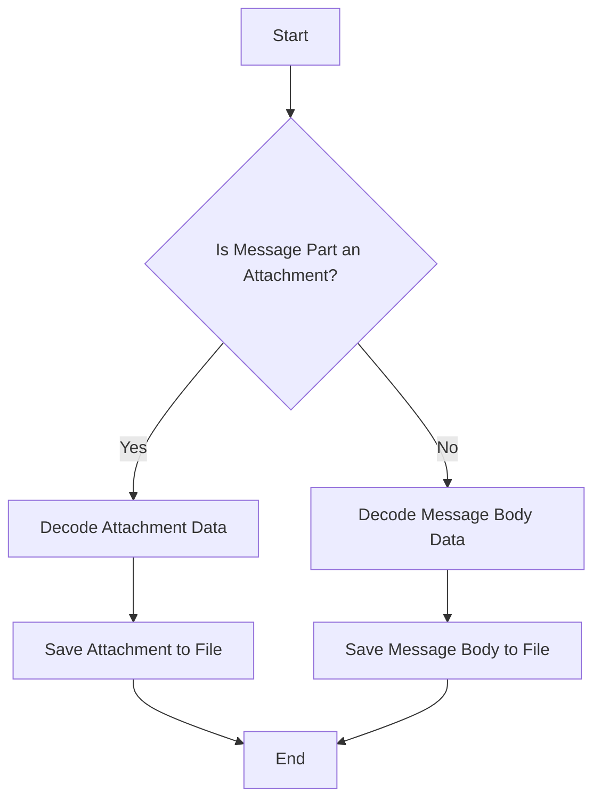

```mermaid
graph TD;
    A[Start] --> B{Is Message Part an Attachment?};
    B -->|Yes| C[Decode Attachment Data];
    B -->|No| D[Decode Message Body Data];
    C --> E[Save Attachment to File];
    D --> F[Save Message Body to File];
    E --> G[End];
    F --> G;
```